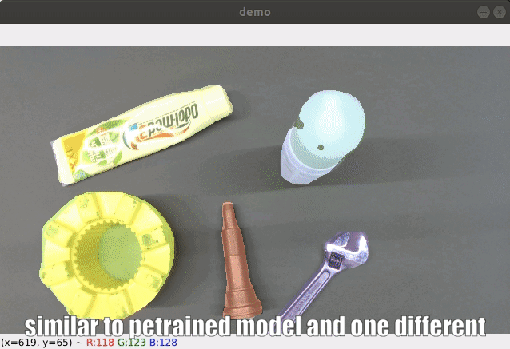
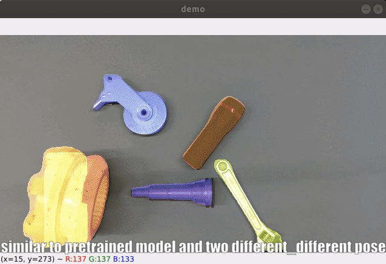
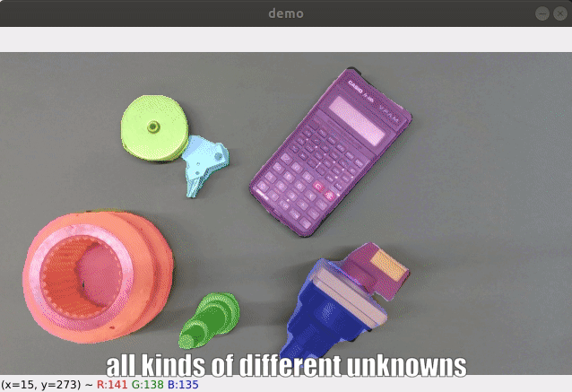
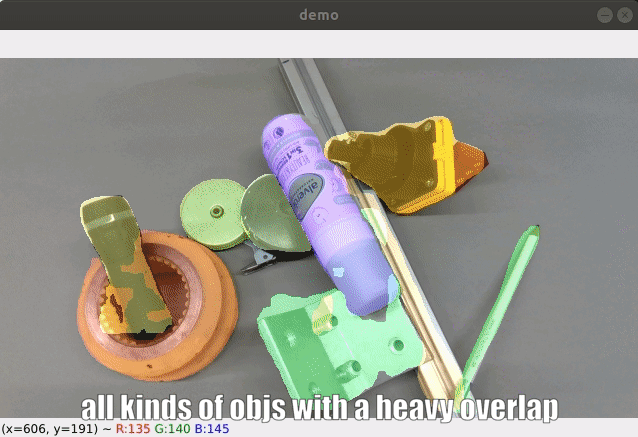

# Synthetic Dataset RGB-D Fusion Mask R-CNN for unknown objects segmentation

## Updates
### Test in different scenes by realsense d435(2022/05/27)

### Integrate ZED Camera to inference (2022/06/10)
> [zed_demo.py](https://github.com/pengfeichu1992/SF-Mask-RCNN/blob/main/zed_demo.py)

### (TEST ONLY) Re-generate synthetic dataset and retrain for better result? (2022/06/..)
