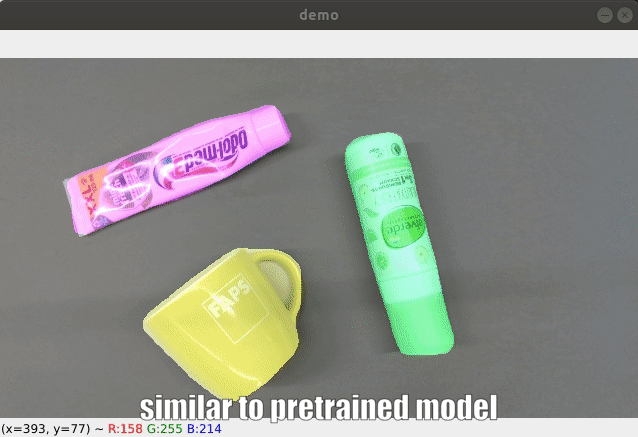

# Synthetic Dataset RGB-D Mask R-CNN for unknown objects segmentation
 
> S. Back, J. Kim, R. Kang, S. Choi and K. Lee. **Segmenting unseen industrial components in a heavy clutter using rgb-d fusion and synthetic data.** github: https://github.com/gist-ailab/SF-Mask-RCNN)

## Updates
- Test in different scenes (2020/05/27)

- Train dataset has been released (2022/05/16)

